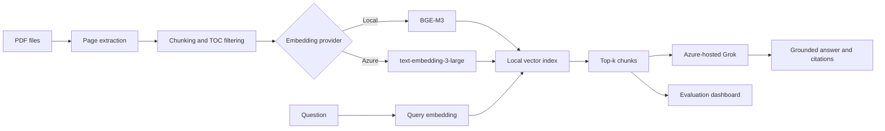

# Enterprise RAG Evaluation Platform

A production-minded document assistant that combines PDF ingestion, selectable
local or Azure embeddings, grounded answer generation, retrieval debugging, and
an evaluation dashboard.

The application is built with Streamlit and is designed to make RAG quality
measurable rather than relying only on visually plausible answers.

## Highlights

- Multi-PDF ingestion with page-level source metadata
- Sentence-aware overlapping chunking
- Table-of-contents noise filtering
- Selectable embedding provider:
  - Local `BAAI/bge-m3`
  - Azure `text-embedding-3-large` or another compatible deployment
- In-memory cosine-similarity vector search
- Azure-hosted Grok answer generation
- Page-level citations and retrieval debugger
- Retrieval-only evaluation without LLM cost
- Optional answer generation and LLM-as-a-judge evaluation
- Precision@k, Recall@k, MRR, Hit Rate@k, latency, faithfulness, relevance,
  context quality, and answer correctness metrics

## Architecture



The document and query embeddings must always come from the same provider.
Changing the provider therefore requires re-indexing the uploaded documents.

## Benchmark

The included evaluation workflow was tested with a 24-question Turkish golden
set over a software specifications document.

| Metric | Azure `text-embedding-3-large` | Local BGE-M3 |
|---|---:|---:|
| Precision@5 | **0.575** | 0.525 |
| Recall@5 | **0.958** | 0.931 |
| MRR | **0.938** | 0.868 |
| Hit Rate@5 | **1.000** | 0.958 |
| Mean retrieval latency | 264 ms | **103 ms** |
| Answer correctness | **1.000** | 0.994 |

These numbers are project-specific and should not be treated as universal model
benchmarks. Use your own documents and golden test set when choosing an
embedding provider.

## Requirements

- Python 3.10 or 3.11
- An Azure AI Foundry model endpoint and API key for answer generation
- Optional Azure embedding deployment
- Approximately 2-3 GB of free disk space for local BGE-M3 dependencies

## Installation

```powershell
git clone https://github.com/YOUR-USERNAME/enterprise-rag-evaluation.git
cd enterprise-rag-evaluation

python -m venv .venv
.\.venv\Scripts\Activate.ps1
python -m pip install --upgrade pip
pip install -r requirements.txt

Copy-Item .env.example .env
```

Linux and macOS:

```bash
python -m venv .venv
source .venv/bin/activate
pip install -r requirements.txt
cp .env.example .env
```

## Configuration

Fill in `.env` with your own deployments. Never commit this file.

```env
AZURE_MODEL_ENDPOINT=https://YOUR-RESOURCE.services.ai.azure.com/models
AZURE_MODEL_API_KEY=YOUR_SECRET_KEY
AZURE_MODEL_DEPLOYMENT=grok-4-1-fast-non-reasoning

EMBEDDING_PROVIDER=local_bge
EMBEDDING_MODEL=BAAI/bge-m3

# Required only when Azure Embedding is selected.
AZURE_EMBEDDING_DEPLOYMENT=text-embedding-3-large

# Optional: omit these to reuse the model endpoint and API key above.
AZURE_EMBEDDING_ENDPOINT=
AZURE_EMBEDDING_API_KEY=
```

The Azure deployment name can also be entered from the Streamlit sidebar.

## Run

Verify the Azure generation connection:

```powershell
python test_connection.py
```

Start Streamlit:

```powershell
streamlit run app.py --server.fileWatcherType none
```

Open [http://localhost:8501](http://localhost:8501), select an embedding
provider, upload a PDF, and click **Belgeleri indeksle**.

## Evaluation

1. Index the document on the main page.
2. Open the **Evaluation** page.
3. Upload a golden test set matching
   `evaluation/test_cases.example.json`.
4. Keep **Her test için model cevabı üret** disabled for retrieval-only
   evaluation.
5. Enable answer generation and LLM judge only when Azure quota permits it.

Golden test case schema:

```json
[
  {
    "id": "q01",
    "question": "What is the main subject of the document?",
    "reference_answer": "Expected grounded answer.",
    "relevant_sources": [
      {
        "source": "document.pdf",
        "page": 1
      }
    ]
  }
]
```

## Tests

Install the development dependency and run the test suite:

```powershell
pip install -r requirements-dev.txt
pytest
```

The GitHub Actions workflow runs compilation, unit tests, and a tracked-file
secret-pattern check on pushes and pull requests.

## Known Limitations

- The vector index is in memory and is cleared when Streamlit restarts.
- Page-level golden labels can overestimate retrieval quality when the correct
  page is returned but the exact supporting chunk is not.
- LLM-as-a-judge scores can be biased, especially when the generator and judge
  use the same model family.
- Azure API calls are subject to cost, quota, and regional rate limits.
- The current retriever is dense-only; hybrid search and reranking are planned.

## Security

- Store credentials only in `.env` or a secret manager.
- Do not upload confidential documents to deployments that are not approved for
  that data.
- If a key was ever committed, rotate it even after removing it from Git
  history.

See [SECURITY.md](SECURITY.md) for vulnerability reporting guidance.

## Roadmap

- Persistent vector storage
- Azure AI Search hybrid retrieval
- Cross-encoder or hosted reranking
- Chunk-level ground-truth labels
- Automated embedding A/B comparison report

## License

This project is available under the [MIT License](LICENSE).
